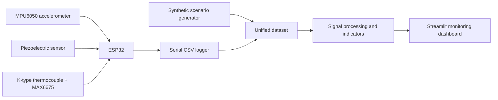

# Railway Structural Health Monitoring Prototype

A low-cost structural-health-monitoring prototype that combines **ESP32 sensor acquisition, vibration and temperature measurements, damage indicators, synthetic scenario generation, and an interactive Streamlit dashboard** for railway infrastructure monitoring.

The project explores how inexpensive hardware and interpretable data processing can be used to identify train passages, visualise structural-response signals, and track a simplified condition indicator over time.

> **Project status:** functional educational prototype. The damage metric is a configurable engineering indicator for experimentation and visualisation; it is not a certified remaining-life model.

## System overview

The prototype connects three layers:

1. **Embedded sensing** — an ESP32 collects acceleration, piezoelectric response, and temperature data.
2. **Data pipeline** — serial measurements are stored in CSV format and normalised into a common schema.
3. **Monitoring dashboard** — Streamlit displays current condition, train events, sensor trends, damage indicators, and estimated remaining-life percentages.



## Hardware

The current prototype uses:

- **ESP32** microcontroller;
- **MPU6050** accelerometer and gyroscope;
- **piezoelectric sensor** for impact and vibration response;
- **K-type thermocouple**;
- **MAX6675** thermocouple interface.

Reference ESP32 connections used during development:

| Component | Signal | ESP32 pin |
|---|---|---:|
| MPU6050 | SDA | GPIO 21 |
| MPU6050 | SCL | GPIO 22 |
| MPU6050 | INT | GPIO 33 |
| MAX6675 | SCK | GPIO 18 |
| MAX6675 | CS | GPIO 5 |
| MAX6675 | SO | GPIO 19 |
| Piezo sensor | Analog output | GPIO 34 |

The MPU6050 is configured at address `0x68` with `AD0` connected to ground.

## Data pipeline

The repository supports both real and synthetic measurements.

Real sensor data can include:

- timestamp;
- temperature;
- three-axis acceleration;
- acceleration magnitude;
- piezoelectric or strain proxy;
- train-detection state.

The dashboard contains a robust CSV reader that handles common delimiter and timestamp variations, maps alternative column names, and creates missing derived variables when possible.

Synthetic data is included to test the complete dashboard without requiring the physical prototype to remain connected. Demo records distinguish between normal periods and simulated train passages.

## Condition indicator

The current prototype combines three normalised components:

- `P` — piezoelectric or strain-response indicator;
- `T` — temperature-deviation indicator;
- `A` — acceleration indicator.

The dashboard uses the following configurable weighted indicator:

```text
D = 0.45 P + 0.10 T + 0.45 A
```

The weighting gives greater importance to vibration-related signals while retaining a smaller temperature contribution.

The current interface groups observations into three operational states:

- **Normal**
- **Attention**
- **Alert**

These thresholds are intended for prototype experimentation and visual communication. They require calibration against controlled experiments and domain-specific structural criteria before real infrastructure use.

## Dashboard capabilities

The Streamlit application includes:

- current system status;
- key sensor indicators;
- robust loading of real and synthetic datasets;
- time-series visualisation;
- train-passage detection;
- temperature, acceleration, and piezo-response analysis;
- instantaneous and accumulated damage views;
- simplified remaining-life visualisation;
- event filtering and historical inspection;
- automatic refresh for continuously updated CSV data.

The main application entry point is:

```text
app.py
```

The default dashboard dataset is:

```text
DATA/dataset_final_maestro.csv
```

## Engineering decisions

### Interpretable fusion instead of a black-box score

The condition indicator is explicitly decomposed into vibration, temperature, and piezoelectric contributions. This makes the result easier to inspect and discuss.

### One schema for real and synthetic data

The dashboard maps several possible sensor column names into a common internal structure. This allows hardware measurements and synthetic scenarios to be analysed through the same interface.

### Synthetic scenarios for end-to-end testing

A simulated day makes it possible to validate dashboard behaviour, train-passage events, cumulative indicators, and deployment without depending on live hardware.

### Honest separation between monitoring and prognosis

The current damage and life values are prototype indicators. A validated remaining-useful-life model would require repeated experiments, labelled degradation states, calibration, uncertainty analysis, and railway-domain validation.

## Technologies

- ESP32
- Arduino / embedded C++
- Python
- pandas
- NumPy
- Streamlit
- Plotly
- Serial data acquisition
- Sensor fusion
- Structural health monitoring concepts

## How to run the dashboard

```bash
git clone https://github.com/javiergonzalvez07-star/Proyecto1.git
cd Proyecto1

python -m venv .venv
```

Activate the environment:

```powershell
# Windows PowerShell
.\.venv\Scripts\Activate.ps1
```

```bash
# macOS / Linux
source .venv/bin/activate
```

Install the required packages:

```bash
python -m pip install --upgrade pip
python -m pip install streamlit pandas numpy plotly
```

Launch the application:

```bash
python -m streamlit run app.py
```

## Limitations

- The prototype has not been calibrated against certified railway structural measurements.
- Sensor mounting and mechanical coupling strongly affect the signals.
- The piezoelectric channel is used as a response proxy and requires calibration.
- Environmental effects and operational variability can alter thresholds.
- The current damage function is heuristic and does not represent a validated fatigue law.
- Synthetic scenarios are useful for software testing but do not replace field data.

## Next steps

- Record repeatable laboratory loading experiments.
- Calibrate each sensor channel against known physical inputs.
- Extract frequency-domain vibration features.
- Add anomaly detection with uncertainty estimates.
- Separate train signatures from environmental and mounting noise.
- Validate damage indicators against controlled degradation states.
- Deploy data ingestion on an always-on low-power edge computer.
- Support multiple distributed ESP32 sensor nodes.

## Author

**Javier Gonzálvez Sempere**  
Double Degree student in Mathematical Engineering and Physics, interested in sensing, simulation, data analysis, IoT, and applied engineering systems.

- Project page: https://javiergonzalvez07-star.github.io/projects/railway-structural-monitoring/
- Portfolio: https://javiergonzalvez07-star.github.io/
- GitHub: https://github.com/javiergonzalvez07-star
